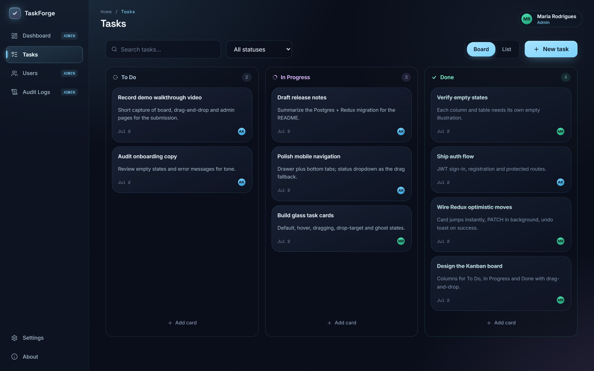
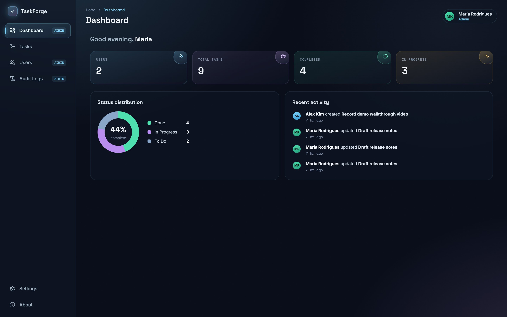
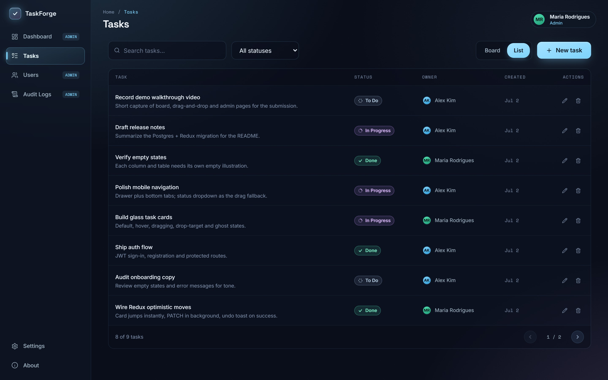
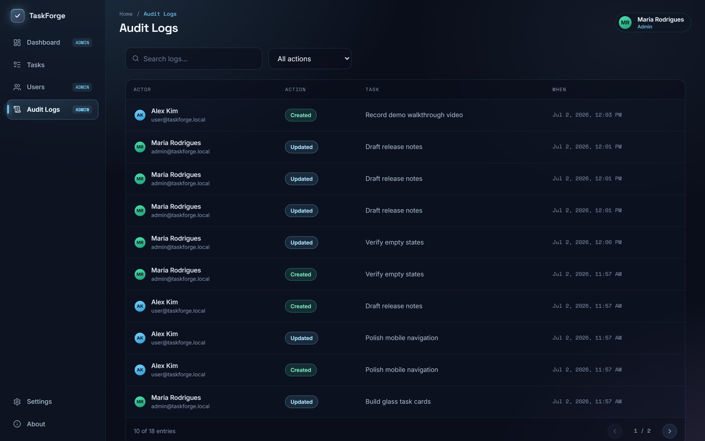
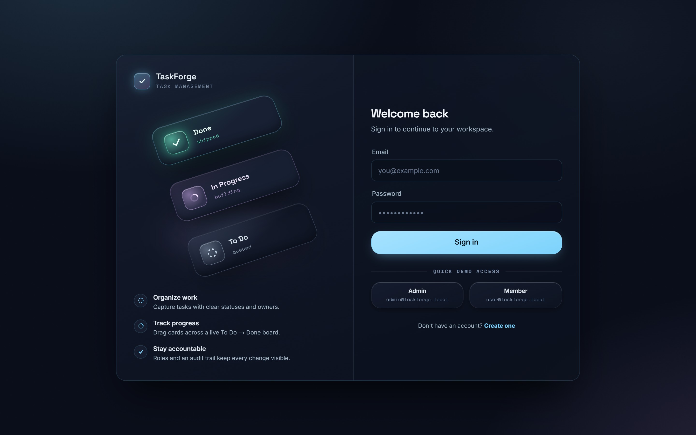
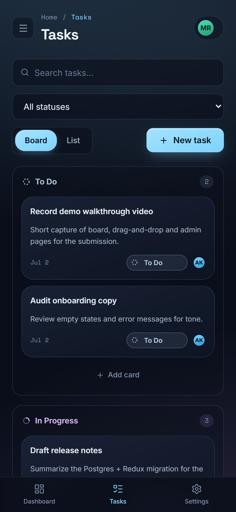

# TaskForge — Task Management Dashboard

A glassmorphic task management dashboard built with **Next.js (App Router) · TypeScript · Tailwind CSS · PostgreSQL (Prisma) · Redux Toolkit**.

**Live demo:** [taskforge-dusky.vercel.app](https://taskforge-dusky.vercel.app) — sign in with the demo accounts below.



## What is TaskForge?

TaskForge is a small team task tracker. Work lives as cards on a **drag-and-drop Kanban board** across three statuses — **To Do → In Progress → Done** — with a table view for dense scanning. Dragging a card updates its status **optimistically**: the UI moves instantly, the change persists in the background, and an **Undo** toast lets you take it back. If the request fails, the card snaps back on its own.

There are two roles. **Members** manage only their own tasks. **Admins** additionally get a live **dashboard** (totals + status distribution), a **users directory**, and a full **audit log** — every create, update and delete is recorded with its actor and timestamp.

> **Migration note (for reviewers):** this project was deliberately built *on top of* an earlier full-stack build rather than started fresh — see [What existed vs. what changed](#what-existed-vs-what-changed). The pre-migration version is preserved under the `v1-express-mongo` tag, and the pull request history documents the whole migration.

## Demo credentials

| Role | Email | Password |
|---|---|---|
| Admin | `admin@taskforge.local` | `Password123` |
| Member | `user@taskforge.local` | `Password123` |

The login page has one-click quick-fill buttons for both accounts.

## Screens

**Admin dashboard** — live stats, status distribution and the latest activity:



**List view** — the same tasks with search, status filter and server-side pagination:



**Audit log** — who did what, when, with action filters:



**Sign in & mobile** — split-screen auth with demo quick-fill; the board stacks into a single column on phones with a status dropdown standing in for drag-and-drop:

| Login | Mobile board |
|---|---|
|  |  |

## Assignment requirements coverage

| Requirement | Where |
|---|---|
| List tasks with title, description, status, created date | Board cards + list view (`/tasks`) |
| Add, update status (To Do / In Progress / Done), delete | Modal create/edit · **drag between columns** (dropdown fallback on touch) · delete with confirm |
| Redux for state management | Redux Toolkit: `authSlice`, `tasksSlice` (async thunks + **optimistic moves with rollback & undo**), `adminSlice`, `uiSlice` |
| PostgreSQL for data storage | Prisma ORM, relational schema with FKs + indexes (`prisma/schema.prisma`) |
| Responsive UI + loading/empty/error states | Mobile drawer + bottom tabs, per-column empty states, skeletons, error banners with retry |
| Proper TypeScript types | End-to-end: shared `types/`, typed store hooks, Zod-validated API |
| Brief README | This file |

**Beyond the brief (carried over from v1 and upgraded):** JWT auth + registration, user/admin RBAC, admin dashboard with live stats, users directory, full audit log, search/filter/pagination, Zod request validation, centralized error handling.

## What existed vs. what changed

This repo previously contained my earlier internship assignment: the same task-management domain built as **React (Vite) + Express + MongoDB (Mongoose)** with Context-based state.

| Layer | Before (v1) | After (this build) |
|---|---|---|
| Framework | React + Vite SPA, separate Express server | Single **Next.js App Router** app (UI + API route handlers) |
| Database | MongoDB + Mongoose | **PostgreSQL + Prisma** (relational schema, FKs, migrations) |
| State | React Context + per-page `useState` | **Redux Toolkit** with async thunks + optimistic updates |
| Tasks UX | Table only, status edited via modal | **Kanban board** with drag-and-drop + undo, board⇄list toggle, created dates |
| Design | Hand-rolled dark glass UI | Token-based **design system** (see `design-export/docs/`) with CSS-3D brand assets |
| Kept | JWT auth, user/admin roles, task CRUD rules, audit logging, validation approach — re-implemented on the new stack |

The old code is preserved in git history (tag `v1-express-mongo`).

## Tech stack

- **Next.js 15** (App Router) + **React 19** + **TypeScript** (strict)
- **Tailwind CSS v4** — design tokens as `@theme` CSS variables
- **PostgreSQL** via **Prisma 6** (works with local Postgres/Docker or Neon)
- **Redux Toolkit** + React-Redux (typed hooks)
- **Zod** (API validation) · **bcryptjs** (password hashing) · **jsonwebtoken** (JWT)
- Deployed on **Vercel** with a **Neon** serverless Postgres

## Getting started

**Prerequisites:** Node 20+, and a PostgreSQL database (either is fine):
- Docker: `docker compose up -d` (starts Postgres 16 on `localhost:5432`)
- Or a free [Neon](https://neon.tech) database

```bash
# 1. Install
npm install

# 2. Configure — copy and fill DATABASE_URL, DIRECT_URL + JWT_SECRET
#    (DIRECT_URL = non-pooled connection used by migrations; for Neon remove "-pooler")
cp .env.example .env

# 3. Create tables + demo data
npm run db:migrate     # prisma migrate dev
npm run db:seed        # demo admin/member + sample board

# 4. Run
npm run dev            # http://localhost:3000
```

`npm run build && npm start` for production. `npm run lint` type-checks.

## API overview

All routes live under `/api/v1` and return JSON. Protected routes expect `Authorization: Bearer <token>`.

| Method | Route | Access | Purpose |
|---|---|---|---|
| POST | `/auth/register` | public | Create account (role `user`) |
| POST | `/auth/login` | public | Sign in → `{ token, user }` |
| GET | `/auth/me` | auth | Current user |
| GET | `/tasks` | auth | Own tasks — search, status, page, limit |
| POST | `/tasks` | auth | Create task |
| GET/PATCH/DELETE | `/tasks/:id` | owner or admin | Read / update (partial) / delete |
| GET | `/admin/stats` | admin | Totals by status + user count |
| GET | `/admin/users` | admin | User directory (search, role filter, pagination) |
| GET | `/admin/tasks` | admin | All tasks across users |
| GET | `/admin/logs` | admin | Audit trail (task.created / updated / deleted) |

**RBAC rules:** members only ever see and mutate their own tasks (enforced server-side); admins can view all users/tasks/logs and delete any task. Every create/update/delete writes an audit log entry with actor, task snapshot, and timestamp.

## Project structure

```
app/                  # Next.js App Router
  (auth)/             #   login, register (public-only)
  (app)/              #   dashboard, tasks, users, audit-logs, settings, about (protected)
  api/v1/             #   route handlers: auth, tasks, admin
components/           # design-system UI, layout shell, kanban, dashboard widgets, CSS-3D assets
store/                # Redux Toolkit slices + typed hooks
lib/                  # client API wrapper, server auth/validators/serializers, prisma client
prisma/               # schema.prisma, migrations, seed script
types/                # shared TypeScript contracts
docs/screenshots/     # README images
design-export/docs/   # design system: tokens, skill guide, asset inventory
```

## Security notes

- Passwords hashed with bcrypt (12 rounds); never returned by the API.
- JWT verified on every protected route; role guards on all admin routes; ownership checks on task access.
- All input validated with Zod (body + query), centralized error mapping, no stack traces leaked.
- Demo-friendly token storage (localStorage) is a deliberate trade-off for reviewer convenience; an httpOnly cookie is the production path.

## Scalability notes

- **Modular by construction:** slices, route handlers, and lib layers split cleanly; the API namespace (`/api/v1`) can lift out into a standalone service without client changes.
- **Relational schema** with indexes on hot foreign keys; pooled Prisma client; pagination server-side everywhere.
- Ready next steps: Redis for session/stats caching, httpOnly-cookie auth, rate limiting at the edge, background workers for audit fan-out, and CI with migration checks.
